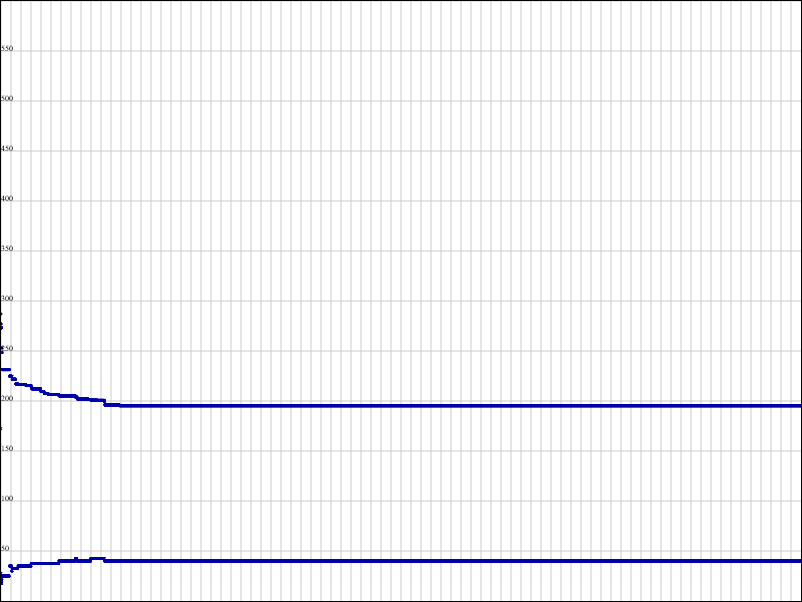
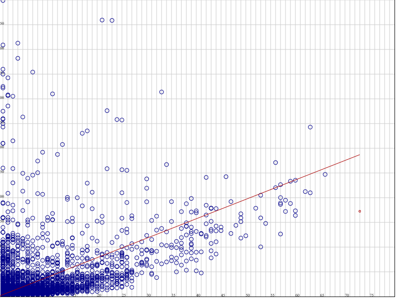

## Notes

### From `test/` data:
#### Cart cost in full search

#### Vendors distribution
- x = num cards
- y = cart cost
- red line to initial cart (all lowest value articles)
- red point is shipping cost for initial cart

